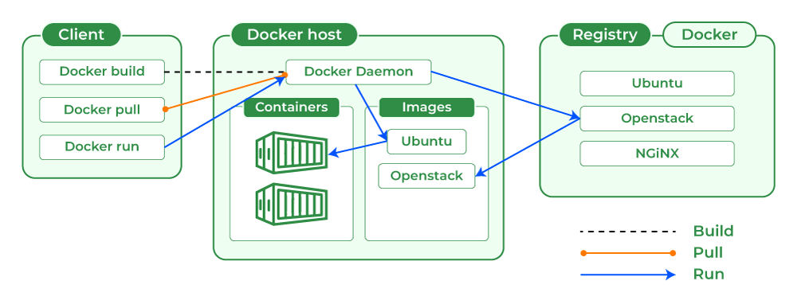

# Microservice with Docker

- One of the advantages of microservices is that each microservice is independent of another. Each can have a
  different programming language and database system
- Problem: having different tech/programming languages in every microservice causes deployment to be complex.
  You don't want different deployment procedures for each different microservice type.
- Docker(containerization) solves deployment, portability, scalability of microservices:
    - ***Deployment***: deploy 100s of microservices with less effort and cost
    - ***Portability***: move 100s of microservices across environments with less effort, config and cost
    - ***Scalability***: scale your app based on demand quickly with minimum cost and effort

## Docker Image

- ***Docker image***:
    - Contains everything a microservice needs to run: application runtime (JDK, Python, Node.js etc.), application
      code,
      dependencies
    - A static template, set of bytes
    - When an image is run, it is called ***Docker container***
    - You can run multiple containers from the same image
- With a docker image, you can run it as ***Docker containers*** the same way on any infrastructure (local machine, AWS,
  Azure...)
- Docker images are built on top of ***DockerEngine***. DockerEngine is built on top of the current operating system

## Docker Container

- loosely coupled environment that allows us to run and build software packages(***docker image***).
- These packages include all the dependencies needed to run the package in any environment
- Container = running representation of image

## Deployment

- Traditional/old way of deployment:
    1. choose hardware based on requirements
    2. Install specific OS and version of it
    3. Install application runtime dependencies (ex: Java 17, tomcat etc)
    4. Install the application you want to deploy
- The traditional way of deployment is too manual and prone to error when deploying
- With Docker, you can deploy your application with simple Docker instructions

## Why Docker is Popular

- Before docker, virtual machines were popular:
    - Hypervisor: manages virtual machines
    - Each virtual machine had its own guest OS
    - On top of each guest OS, there were pieces of software needed to run application.
      And on top of it, your application would lie.
- Major problem with VM: typically they were heavyweight since there is one host OS and guest OS for each VM
- With Docker, all you need to do is install docker engine on top of specific host OS. Docker engine takes care of
  managing all containers. There is only one OS: host; thus docker is very efficient and lightweight

  

- **Software containerization**:
    - OS virtualization method that is used to deploy and run containers without using VM
    - When we deploy multiple containers in a single VM/server, these containers use a single OS. However, each
      container thinks that they are the only one using that OS
    - Similarly, in VM approach, we are virtualizing VMs.
      Each VM thinks that they are running in different OS/machines.
      However, in reality they run on the same host OS
    - In containerization, the virtualization is at OS level; on the other hand, in VMs the virtualization is at the
      hardware level

## What Happens in Containerization?

- Linux features (`namespace`, `cqgroups`) provides isolation and resource management
- `namespace`:
    - Allows creation of isolated environments within OS
    - Each container has its own namespaces: process, network, mount, IPC(interprocess communication), user namespaces
    - Namespaces allow processes to only be aware of resources in the same namespace. Thus, processes can only
      interact with the resources in the same namespace
- `cggroups` (control groups):
    - Provide resource management and allocation capabilities for containers
    - Allow admin to limit resources (CPU, RAM, etc.) that container can consume

- **Disadvantages of VM**:
    - You will have your microservices in different VMs. You have to manually install all the libraries/dependencies
      manually for each VM/microservice. Each microservice may need a different version or different libraries. This
      will be even more troublesome when you have many microservices.
    - Cannot scale quickly in response to increased traffic: you cannot just directly increase the number of instances
      of a
      microservice: you need to create VM,
      install libraries/dependencies. It will take some time to install these and create a VM.
    - Having OS for each VM creates overhead, increases cloud cost

- **Advantages of Docker**:
    - OS is shared among containers/services -> light weight
    - Creating/destroying containers is easy->good scalability
    - Each container is isolated: each service will have its own virtual network and virtual environment. ContainerA
      will not know about containerB
    - Each container is a packaged component: all the dependencies are installed, all automatic

## Architecture of Docker

- ***Docker client***:
    - place where we are running docker commands
    - By using commands, we give instructions to Docker server on how to containerize our apps. (Don't assume that
      docker server is remote, it is actually installed on your machine)
    - We can use 2 components to issue commands:
        1. Docker Remote API
        2. Docker CLI (most common)
- ***Docker Daemon/engine***:
    - Docker Daemon receives commands issued from Docker Client
    - Convert your commands to a packaged software which is called Docker Image.
      It has all the dependencies and libraries needed.
    - manages containers, local images, pulling/pushing from/to image registry
- ***Docker Registry***
    - Used to push images to remote (Docker Hub)
    - Docker Daemon pulls images that are needed according to the command but not available at local from Docker Hub



## Creating Docker Image

1. Dockerfile: create a file with docker instructions on how to create image.
   However, there is much consideration that you have to manually adjust in Dockerfile: compression, caching, security
2. Buildpacks: simplifies containerization, so that you don't need to write low-level Docker code
3. Google Jib: maintained by Google to create images of Java apps, simplifies containerization

## Analyzing Example From in28min

- Docker command used to deploy spring boot application: `docker run in28min/todo-rest-api-h2:1.0.0.RELEASE`
- When this command is run, the image is downloaded from `hub.docker.com` ***(docker registry)***
- ***Docker registry***: contains repos and apps with different versions
- ***Docker repository***:
    - `hub.docker.com/r/in28min/todo-rest-api-h2`
    - Stores all the versions of a specific app

### Bridge Network

- Notice that when the docker container is running in your machine you won't be able to
  access `localhost:5000/hello-world`
- Correct command:
    - `docker run -p 5000:5000 in28min/todo-rest-api-h2:1.0.0.RELEASE`
    - `-p {HostPort}:{ContainerPort}`
- By default, any container you run is part of ***bridge network*** in Docker. If you want to access to the container,
  you have to expose container port to the host port.
- In our example, the spring boot application is set to run at port 5000.
  This port will be used inside docker network.
  If we wish, we can access to our application from any port we want from our
  machine `docker run -p 1234:5000 in28min/todo-rest-api-h2:1.0.0.RELEASE` --> localhost:1234/hello-world

## Options in Docker

- `-d`: detached mode, this detaches docker process from terminal. Docker will run in the background even if you press
  ctrl-c in the terminal
- `-f`: tails the logs of app

## Playing with Images

- You can give multiple tags to a single image:

```bash
docker run in28min/todo-rest-api-h2:1.0.0.RELEASE #create image with tag 1.0.0.RELEASE

docker tag in28min/todo-rest-api-h2:1.0.0.RELEASE in28min/todo-rest-api-h2:latest #create image with tag latest from existing image

docker images # you can see that latest and 1.0.0.RELEASE both point to the same version
REPOSITORY                 TAG             IMAGE ID       CREATED         SIZE
in28min/todo-rest-api-h2   1.0.0.RELEASE   814e9d2807cc   22 months ago   141MB
in28min/todo-rest-api-h2   latest          814e9d2807cc   22 months ago   141MB
```

- `latest` tag doesn't mean anything in docker, it is just a name. When you execute `docker pull mysql:latest`, you are
  not guaranteed to pull the latest version
- `docker pull ...`: pulls an image but doesn't run
- `docker run ...`: pulls an image if not available in local, then runs it
- Searching for images and identifying official images:

```bash
docker search mysql

NAME                            DESCRIPTION                                     STARS     OFFICIAL
mysql                           MySQL is a widely used, open-source relation…   15006     [OK]
circleci/mysql                  MySQL is a widely used, open-source relation…   29        
```

- Official images are maintained by DockerHub, so you would want to use official images for your apps whenever possible
- `docker image history 814e9d2807cc`: lists steps involved in creating a specific image
- `docker image inspect 814e9d2807cc`: you can find all the metadata for the image
- `docker image remove 814e9d2807cc`: deletes image from local

## Playing with Containers

- `docker container pause b828e61...`: To pause/unpause a container (use container id)
- `docker container inspect`
- `docker container prune`: removes all stopped containers
- `docker stop b828e61...`:
    - ***gracefully*** shutdowns the container
    - This command gives container a few seconds to finish its processes: shuts down ExecutorService, closes entity
      manager
      factory, drops tables/sequences, shuts down connection pool. This is called ***SIGTERM***
- `docker kill b828e61...`: stop the container as it is, immediately. This is called ***SIGKILL***
- `docker run --restart=always in28min/todo...`:
    - automatically starts the container whenever you open Docker Desktop.
    - Default value is `no`
    - Invaluable for the images that you want them to be always running, such as DB

## Playing with Commands

- `docker container ls`: lists all containers
- `docker events`: logs all the events that are happening in background in docker: which container is paused, stopped,
  started etc.
- `docker top b828e61...`: sows the top process which is running in a container
- `docker stats`: shows stats for all running containers
- `docker run -m 512m --cpu-quota 5000 in28min/todo...`:
    - assign a limit for memory usage of 512 megabytes (you can use *G* for gigabyte)
    - assign a limit for CPU usage of 5000 (max CPU usage is 100,000)
- `docker system df`: show everything that docker daemon manages

## Building Image with `Dockerfile`, `Buildpacks`, `Jib`

- `Dockerfile`:
    - **Adv**: gives flexibility to the programmer, enables customization of images to your needs
    - **Dis adv**: you need to be an expert on Docker; caching, security, optimization, best practices, etc. has to be
      done manually
- Why `Buildpacks` is the best?: `https://buildpacks.io/features/` (advanced caching, multi-language)