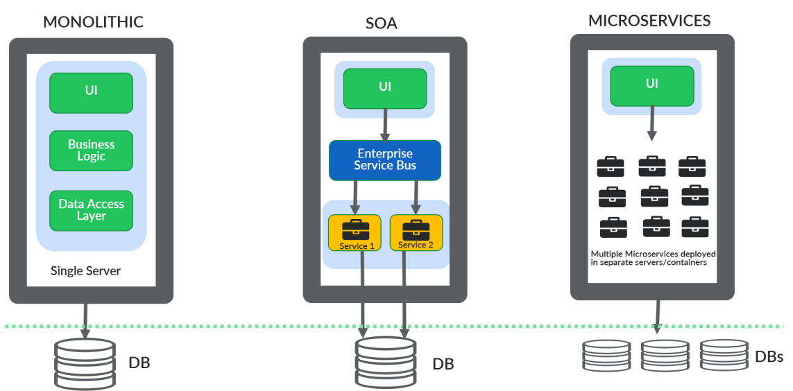

# Microservices

- Imagine a bank app; it provides products such as Accounts, Cards, Loans

## Monolith

- All the business functionality of a bank app is deployed as a single unit in a single server
- ***Presentation layer(HTML, JS, CSS)***, ***business logic layer(backend)***, ***data access layer*** and
  ***database*** are a single unit i a single server
- Monolith apps have only one database

### Advantages of Monolith

1. Simpler development and deployment for small apps and small teams
2. Fewer cross-cutting concerns since all your code deployed inside a single server:
    - non-functional requirements: security, auditing, logging
3. Might have better performance due to no network latency: a call from one service to another will be in the same
   server. There is no network call

### Disadvantages of Monolith

1. Difficult to adopt new tech: if you want to enhance your existing app with new, you might need to update your
   entire code base. Accounts team might want to use the latest framework, but there might be a pushback from
   the Cards/Loans
   team
2. Limited agility: you can't just decide to use a new framework in a day. Because your entire code base is tightly
   coupled
3. Single code base and difficult to maintain: since all of your code is a single unit, it will be hard to maintain as
   your apps grow with new features
4. Not fault tolerance: issues with scalability and availability
5. A tiny development will require a full deployment: your app will have downtime
6. No parallel development
7. Limited scalability: if you want to scale your app, you need to bring up one more server (even though only Accounts
   microservice needs scaling).

## Service Oriented Architecture (SOA)

- SOA emerged as an approach to combat challenges of large monolithic apps
- SOA segregates tightly coupled UI and backend logic:
    - server1 has UI and ESB; server2 has backend services
- For UI to communicate with backend services, ESB is needed
    - Whenever a request comes from the UI to ESB; ESB redirects it to the corresponding service
- Just like in monolith: services are tightly coupled to a single shared DB
- Similar to monolith: a tiny change in BE requires full deployment of BE (Realize that UI and BE are managed in
  different repos, thus a tiny change in BE doesn't require deployment of UI. Only BE needs full deployment)

### Advantages of SOA

1. Reusability of services
2. Better maintainability
3. Higher reliability
4. Parallel development

- In SOA, all your logic is separated into components;
    1. all accounts related logic will be inside the account service.
    2. UI code is separated from backend code. They will live in different servers as well.

    - This is the root reason for all these advantages

### Disadvantages of SOA

1. Complex management: have to manage the communication between services
2. High investment cost to set up an ESB
3. Extra overload: ESB is a component that has to be maintained just for UI-BE communication
4. Parallel development between UI-BE (but there is no parallel development between services in BE)
5. Limited scalability: if you want to scale your app, you need to bring up one more server for BE services and also one
   for ESB

## Microservices

- Microservices are independently deployable services that are built around business domain
- A service encapsulates functionality and makes it accessible to other services via network
- Each microservice has its own DB
- Each microservice will be deployed into their own servers/containers

### Advantages of Microservices

1. Easy to develop, test, deploy: because you loosely coupled all your business logic into separate small components
2. Increased agility: since there is no tight coupling between services, dev teams will have their own
   enhancement/deployment lifecycle
3. Ability to scale horizontally: you can scale a single microservice with containerization
4. Parallel development
5. Modeled around business domain
6. Each microservice can use a different framework, language, DB

### Disadvantages of Microservices

1. Complexity: your services will be in many different containers and clusters. It will be hard to manage communication
   between these services
2. Infrastructure overhead: you are going to deploy your services to multiple servers and containers, however, you still
   need to monitor them which creates infrastructure overhead
3. Security concerns: UI to service, service to service communication will be done with web services which increase
   security concerns. In monolith, communication was done with simple method calls

## Why Use Spring Boot for Microservices?

1. You can build executable JAR files instead of traditional WAR/EAR files. The JAR file contains all the dependencies
   and configs required to run the microservice
    - Apps that are packaged as WARs rely on the presence of a server installed in the execution environment for
      running. That server also needs to have JVM installed.
    - However, a self-contained JAR (fat-JAR/uber-JAR) already contains an embedded server in it.
2. Provides built-in features and integrations: auto-config, dependency injection
3. Provides embedded Tomcat/Jetty server, which can run the microservice directly, without the need for separate server
   installation
4. Built-in production-ready features: metrics, health check, externalized config
5. Enables to quickly bootstrap a microservice project and start coding. There are Starter dependencies that provide
   preconfigured settings for databases, queues, etc. (Before spring boot, you need to do a lot of config&dependency
   management to set up a DB for a service)
6. Suited for cloud native development. Integrates well with Kubernetes, Docker. You can also deploy to them cloud
   providers easily